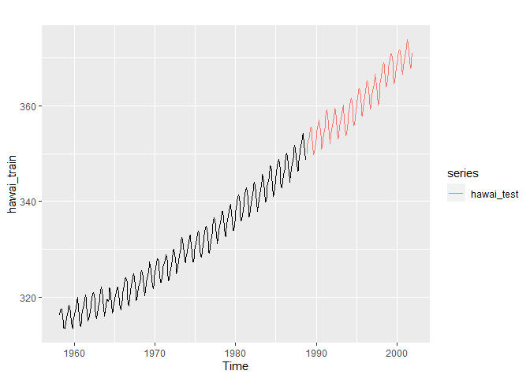
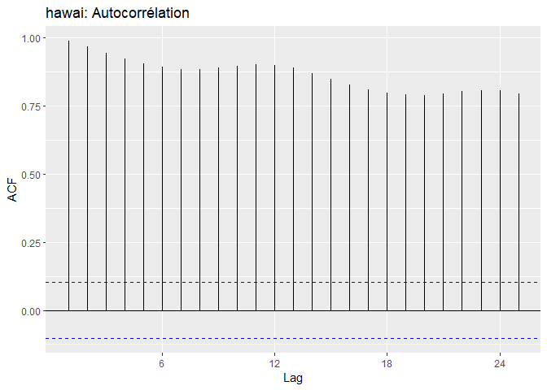
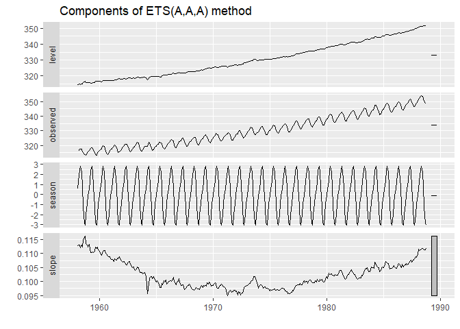
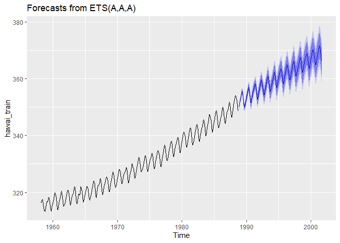
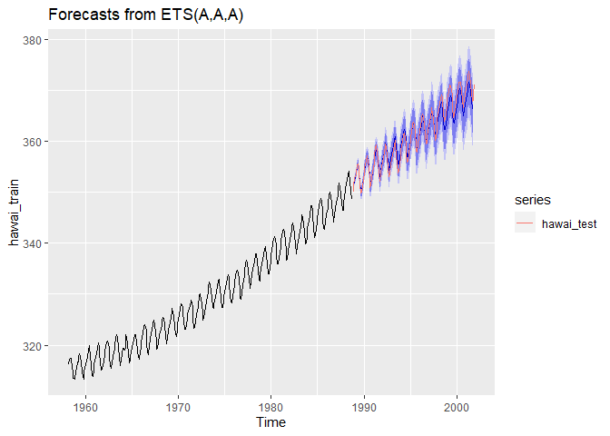

CO2 atmosphérique Hawai
================
Nomena Ravelojaona
21/07/2020

## Importation des données

Les données du fichier hawai.csv comprennent les moyennes des mesures
mensuelles de CO2 atmosphérique en ppm-volume collectées au *Mauna Loa
Observatory* à Hawaii de mars 1958 à décembre 2001, inclusivement.

``` r
library(tidyverse)
```

    ## -- Attaching packages -------------------------------------------------------------------------------- tidyverse 1.3.0 --

    ## v ggplot2 3.3.1     v purrr   0.3.4
    ## v tibble  3.0.1     v dplyr   1.0.0
    ## v tidyr   1.1.0     v stringr 1.4.0
    ## v readr   1.3.1     v forcats 0.5.0

    ## -- Conflicts ----------------------------------------------------------------------------------- tidyverse_conflicts() --
    ## x dplyr::filter() masks stats::filter()
    ## x dplyr::lag()    masks stats::lag()

``` r
options(max.print=1000000)
hawai <- read.csv(file =  "hawai.csv", header = TRUE)
head(hawai,8 )
```

    ##       time      CO2
    ## 1 1958.167 316.1000
    ## 2 1958.250 317.2000
    ## 3 1958.333 317.4333
    ## 4 1958.417 317.4333
    ## 5 1958.500 315.6250
    ## 6 1958.583 314.9500
    ## 7 1958.667 313.5000
    ## 8 1958.750 313.5000

## création de la série temporelle

Une série temporelle du CO2 est créée à partir des données de hawai.csv

``` r
library("forecast")
```

    ## Warning: package 'forecast' was built under R version 4.0.2

    ## Registered S3 method overwritten by 'quantmod':
    ##   method            from
    ##   as.zoo.data.frame zoo

``` r
library("fpp2")
```

    ## Warning: package 'fpp2' was built under R version 4.0.2

    ## Loading required package: fma

    ## Warning: package 'fma' was built under R version 4.0.2

    ## Loading required package: expsmooth

    ## Warning: package 'expsmooth' was built under R version 4.0.2

``` r
hawai_ts <- ts(hawai %>% dplyr::select(-time),
               start = c(hawai$time[1], 1),
               frequency = 12)
head(hawai_ts, 24)
```

    ##           Jan      Feb      Mar      Apr      May      Jun      Jul      Aug
    ## 1958                   316.1000 317.2000 317.4333 317.4333 315.6250 314.9500
    ## 1959 315.5000 316.7000 316.7333 317.6750 318.3250 318.0250 316.5250 314.9000
    ## 1960 316.3800 316.9750                                                      
    ##           Sep      Oct      Nov      Dec
    ## 1958 313.5000 313.5000 313.4250 314.7000
    ## 1959 313.8250 313.4000 314.8750 315.5250
    ## 1960

``` r
autoplot(hawai_ts)
```

<!-- -->

On observe sur la figure la tendance globale de la quantité de CO2.
Probablement, cette tendance à la hausse est expliquée par
l’augmentation des activités humaines mobilisant des énergies fossiles
qui permettent de libérer une quantité significative de CO2.

## Séparation la série en partie d’entraînement (environ 70% des données) et en partie *test*

Pour créer un modèle permettant de prédire la quantité de CO2
atmosphérique mesurée à Mauna Loa Observatory\* à Hawai, nous allons
répartir nos données en 2 blocs : le premier bloc servira de données
d’*entrainement* pour générer le modèle et le deuxième bloc sera
utilisé comme données *test*.

``` r
hawai_train <- head(hawai_ts, round(length(hawai_ts) * 0.7)) ## le premier bloc qui constitue les données d'entrainement (70%)
head(hawai_train, 24)
```

    ##           Jan      Feb      Mar      Apr      May      Jun      Jul      Aug
    ## 1958                   316.1000 317.2000 317.4333 317.4333 315.6250 314.9500
    ## 1959 315.5000 316.7000 316.7333 317.6750 318.3250 318.0250 316.5250 314.9000
    ## 1960 316.3800 316.9750                                                      
    ##           Sep      Oct      Nov      Dec
    ## 1958 313.5000 313.5000 313.4250 314.7000
    ## 1959 313.8250 313.4000 314.8750 315.5250
    ## 1960

``` r
h <- length(hawai_ts) - length(hawai_train)
hawai_test <- tail(hawai_ts, h) ## les 30% restant qui comprennent les données tests
head(hawai_test, 24)
```

    ##          Jan     Feb     Mar     Apr     May     Jun     Jul     Aug     Sep
    ## 1988                                                                        
    ## 1989 352.775 353.000 353.600 355.360 355.600 355.125 353.860 351.575 349.860
    ## 1990 353.650 354.650 355.480 356.175 357.075 356.080 354.675 352.900 350.940
    ##          Oct     Nov     Dec
    ## 1988         350.000 351.360
    ## 1989 350.050 351.200 352.480
    ## 1990 351.225

``` r
autoplot(hawai_train) + autolayer(hawai_test)
```

<!-- -->

Les données d’entrainement comprenant les 70% contiennent la serie
temporelle de mars 1958 à octobre 1988. Les données *test* vont de
novembre 1988 à décembre 2001.

## Création du modèle prévisionnel

Avant de créer le modèle, nous allons analyser notre série temporelle.

**AUTOCORRELATION**

``` r
library("cowplot")
```

    ## Warning: package 'cowplot' was built under R version 4.0.2

    ## 
    ## ********************************************************

    ## Note: As of version 1.0.0, cowplot does not change the

    ##   default ggplot2 theme anymore. To recover the previous

    ##   behavior, execute:
    ##   theme_set(theme_cowplot())

    ## ********************************************************

``` r
plot_grid(ggAcf(hawai_train) + ggtitle("hawai: Autocorrélation"))
```

<!-- -->

La visualisation des seuils de signification de l’autocorrélation
indique que nous pouvons effectuer une modélisation prédictive avec la
série temporelle. Une corrélation positive significative existe pour
nos données.

**Calcul de la probabilité pour voir si nos données constituent ou non
un bruit blanc**

``` r
Box.test(hawai_train, lag = 20, type = "Ljung-Box") ## Pour tester si si la série temporelle entière peut être différenciée d’un bruit blanc.
```

    ## 
    ##  Box-Ljung test
    ## 
    ## data:  hawai_train
    ## X-squared = 5913.7, df = 20, p-value < 2.2e-16

Le *p-value* très faible indique que la probabilité que la série soit un
bruit blanc est presque nulle.

**Modélisation de la série temporelle**

Le modèle ETS(*error, tend and seasonnal*) a été retenu pour modéliser
notre série temporelle. Il s’agit d’un modèle qui automatise la
prévision. A l’issu de l’optimisation du choix de modèle, un modèle
parmi les types de modèles de la famille SES sera retenu.

``` r
hawai_model <- forecast::ets(hawai_train, model = "ZZZ") ## pour générer le modèle
hawai_model
```

    ## ETS(A,A,A) 
    ## 
    ## Call:
    ##  forecast::ets(y = hawai_train, model = "ZZZ") 
    ## 
    ##   Smoothing parameters:
    ##     alpha = 0.6803 
    ##     beta  = 0.0023 
    ##     gamma = 1e-04 
    ## 
    ##   Initial states:
    ##     l = 314.5366 
    ##     b = 0.1127 
    ##     s = 0.5564 -0.0873 -0.9498 -2.0041 -3.0565 -2.879
    ##            -1.1831 0.784 2.2595 2.8566 2.3841 1.3192
    ## 
    ##   sigma:  0.3376
    ## 
    ##      AIC     AICc      BIC 
    ## 1392.687 1394.436 1459.125

``` r
autoplot(hawai_model)
```

<!-- -->

``` r
hawai_forecast <- forecast(hawai_model,h= 12*13 ) ## pour obtenir la prédiction
autoplot(hawai_forecast)
```

<!-- -->

``` r
accuracy(hawai_model)
```

    ##                        ME     RMSE       MAE          MPE       MAPE      MASE
    ## Training set -0.001062961 0.330219 0.2482782 -0.000786347 0.07547246 0.2032564
    ##                    ACF1
    ## Training set 0.05170149

Le modèle retenu est un ETS(A,A,A), définissant dans l’ordre le type
d’erreur, de tendance et de saison Nous avons une erreur, une tendance
et une saison de type A (additive).

## Comparaison avec les données test

Le modèle généré sera évalué avec les données *test* de la série
temporelle

``` r
autoplot(hawai_forecast)+ autolayer(hawai_test)
```

<!-- -->

Le modèle parvient a bien prédire les occurrences futures. La courbe
générée par le modèle parvient à suivre la trace de la courbe des
données observées avec quand même un petit décalage. L’intervalle de
confiance à 95% de la prévision de long terme croît à un niveau
d’incertitude peu utile dans la pratique.

``` r
test_set_accuracy <- hawai_model %>% forecast(h = 12*13) %>%
  accuracy(hawai_test) ## test set
test_set_accuracy[,c("ME","RMSE","MAE","MAPE","MASE")]
```

    ##                        ME     RMSE       MAE       MAPE      MASE
    ## Training set -0.001062961 0.330219 0.2482782 0.07547246 0.2032564
    ## Test set      0.347755513 1.131406 0.8757348 0.24046958 0.7169323

Les indicateurs des écarts nous montrent que les érreurs du modèle ont
faiblement augmenté avec les données *test* comparativement aux données
d’*entrainement*, une situation qui n’est pas du tout inhabituelle. Un
bon ajustement aux données d’entraînement n’indique pas forcément que le
modèle fera de bonnes prévisions.Et c’est bien l’intérêt de procéder à
l’utilisation d’une partie de données comme données *test*. Dans la
prévision, les erreurs sont vraisemblablement accentuées à fur et à
mesure que l’on avance dans le temps.

## Analyse des résidus

``` r
checkresiduals(hawai_model)
```

<!-- -->

    ## 
    ##  Ljung-Box test
    ## 
    ## data:  Residuals from ETS(A,A,A)
    ## Q* = 45.022, df = 8, p-value = 3.645e-07
    ## 
    ## Model df: 16.   Total lags used: 24

La p-value étant très faible, il est peu probable que les résidus
forment un bruit blanc. Les résidus contiennent de l’autocorrélation, ce
qui veut dire qu’il existe une structure dans les résidus. Le modèle ne
réussit totalement pas à capturer toute la dynamique des données.
Néanmoins, l’estimation ponctuelle reste non biaisée.

A ce stade le modèle est fiable pour prédire la quantité de CO2
atmosphérique mesurée dans la station sur un moyen terme. En effet,
l’indice de confiance qui croit à long terme nous suggère que il est
plus adéquat de se concentrer sur la prévision n’allant pas sur une
durée trop longue genre plus de 10-15ans pour avoir une prévision
acceptable. Dans cet intervalle de temps, les prévisions sont encore
moins incertaines car la taille de l’intervalle de confiance à 95% est
encore plus faible.

Cependant, une amélioration de la prévision est toujours possible. Une
piste évidente à poursuivre est d’adopter un modèle dynamique qui permet
de prendre en compte des variables explicatives exogènes.Il pourait
aussi être intéressant d’explorer des modèles à mémoire longue, de type
ARFIMA (GRANGER et JOYEUX \[1980\] et HOSKING \[1981\]), pour capturer
les très fortes inerties présentes dans les résidus.
